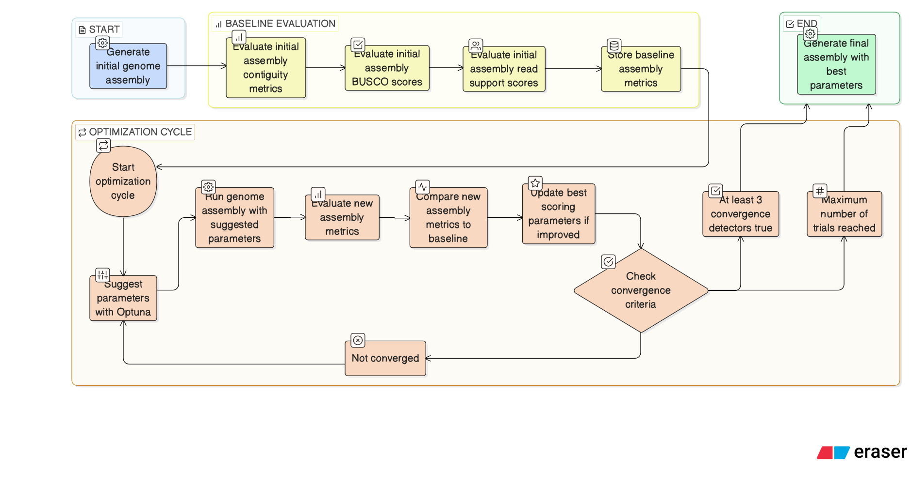

[](https://hub.docker.com/r/fka21/hifimizer)


# Hifimizer

**Hifimizer** is a framework for optimizing *HiFi genome assembly* parameters using Bayesian optimization.
It wraps **hifiasm** in an automated optimization loop powered by **Optuna**, enabling systematic exploration
of the assembly parameter space instead of manual trial-and-error.

The primary goal is to identify parameter configurations that maximize assembly quality metrics
(e.g. contiguity, BUSCO completeness) for a given dataset.

---

## Core idea

Genome assemblers use dozens of parameters, many of which interact non-linearly.
Hifimizer treats assembly as an optimization problem:

- parameter space → hifiasm arguments
- objective function → assembly quality metrics
- optimizer → Bayesian optimization (Optuna)

> **Note**
>
> Due to the stochastic nature of Bayesian optimization and adaptive sampling,
> the *exact sequence of trials and the final best solution* may vary between runs,
> even when random seeds are set.
> While individual components are seeded where possible, full end-to-end
> determinism is not guaranteed, especially under parallel execution.

### Workflow overview



---

## Installation options

You can run Hifimizer in three supported ways.

### Option 1: Conda (native execution)

Create the environment:

```bash
conda env create -f environment.yml
conda activate hifimizer
```

Run
```bash
python3 src/hifimizer.py -h
```
### Option 2: Docker

Pull the prebuilt image:

```bash
docker pull fka21/hifimizer:latest
```

Run:

```bash
docker run --rm \
  -v $(pwd):/wd \
  fka21/hifimizer:latest \
  src/hifimizer.py -h
```

### Option 3: Singularity (for HPC environments)

A definition file (Singularity.def) is included in this repository. Build the container:

```bash
apptainer build hifimizer.sif hifimizer.def
```

Example for running the tool:

```bash
apptainer exec \
  --bind $(pwd):/wd \
  hifimizer-online.sif \
  src/hifimizer.py -h
```

> **Note**
>
> If the HPC environment cannot download the BUSCO database through BUSCO, please download it *a priori* and copy it to your HPC environment. Then specify the `--busco-download-path` when running `hifimizer`.
---

## Requirements
* HiFi (PacBio CCS) reads
* Genome size estimate
* Sufficient computational power for repeated assemblies
* Patience

---
## Manual

Below are listed the available options for running the tool.

```bash
usage: hifimizer.py [-h] [--version] --genome-size GENOME_SIZE --input-reads
                    INPUT_READS [--output-dir OUTPUT_DIR] [--threads THREADS]
                    [--ploidy PLOIDY]
                    [--busco-download-path BUSCO_DOWNLOAD_PATH] [--sensitive]
                    [--num-trials NUM_TRIALS] [--num-reads NUM_READS]
                    [--no-busco] [--busco-lineage BUSCO_LINEAGE]
                    [--multi-objective] [--default-hifiasm] [--primary]
                    [--force-rerun] [--dry-run] [--rerun-best] [--seed SEED]
                    [--hic1 HIC1] [--hic2 HIC2] [--ul UL] [--ont]

Optimize hifiasm de novo genome assemblies with Optuna. Supports parameter
optimization for standard HiFi, Hi-C, and ultra-long ONT assemblies. By
default optimizes: x, y, s, n, m, p. Sensitive mode additionally optimizes D,
N, and max_kocc. Genome size can be specified with a G/Gb (gigabases), M/Mb
(megabases), or K/Kb (kilobases) suffix, or as a plain integer interpreted as
megabases.

options:
  -h, --help            show this help message and exit
  --version             show program's version number and exit

Required arguments:
  --genome-size GENOME_SIZE
                        Haploid genome size. Accepts a plain integer (treated
                        as Mb) or a value with a suffix: G/Gb for gigabases,
                        M/Mb for megabases, K/Kb for kilobases (e.g. 3G,
                        1.5Gb, 300M, 300, 750k). Internally converted to whole
                        megabases. (default: None)
  --input-reads INPUT_READS
                        Input HiFi reads file path (default: None)

General settings:
  --output-dir OUTPUT_DIR
                        Directory to store output files. (default: output)
  --threads THREADS     Number of threads to use (default: 40)
  --ploidy PLOIDY       Ploidy of the genome (default: 2)
  --busco-download-path BUSCO_DOWNLOAD_PATH
                        Custom BUSCO download path. If set, BUSCO datasets
                        will not be (re)downloaded. (default: None)

Optimization options:
  --sensitive           Optimize D, N, and max_kocc for possibly higher
                        quality (longer runtime). Can be used in combination
                        with --primary, --hic1, --hic2, and --ul to optimize
                        Hi-C and ultra-long read parameters as well. Will also
                        optimize x, y, s, n, m, and p parameters. (default:
                        False)
  --num-trials NUM_TRIALS
                        Number of trials for optimization. First 20 trials
                        will always run, afterwards a custom multi-criteria
                        convergence detector is used to detect convergence.
                        (default: 100)
  --num-reads NUM_READS
                        Number of reads to subset for minimap2 (default:
                        100000)
  --no-busco            Disable BUSCO metrics during evaluation. By default,
                        BUSCO metrics are included. (default: True)
  --busco-lineage BUSCO_LINEAGE
                        BUSCO lineage database name (default: metazoa_odb12)
  --multi-objective     Use multi-objective optimization (Pareto front).
                        Default is single-objective optimization with weighted
                        score. (default: False)
  --default-hifiasm     Run hifiasm assembly without optimized parameters,
                        i.e. use all default parameter settings. Note: default
                        behaviour of hifimizer saves the default assembly
                        results into a default_assembly folder in the output
                        directory. (default: False)
  --primary             Perform primary assembly only. Can be used in
                        combination with --default, --hic1, --hic2, and --ul
                        to run hifiasm with default settings, Hi-C and ultra-
                        long reads. (default: False)
  --force-rerun         Force rerun of optimization and assembly even if
                        convergence was previously reached. (default: False)
  --dry-run             Validate inputs and environment without running any
                        assemblies. Checks that all input files exist,
                        required tools (hifiasm, busco, gfastats) are on PATH,
                        and prints the trial-0 hifiasm command, then exits.
                        (default: False)
  --rerun-best          Skip optimization and rerun hifiasm using the best
                        parameters recorded in an existing study. Requires
                        that the previous run reached convergence.
                        Incompatible with --force-rerun. (default: False)
  --seed SEED           Random seed for reproducibility. If not set, results
                        may vary between runs. (default: 42)

Optional sequencing data or hifiasm settings:
  --hic1 HIC1           Hi-C R1 reads file (default: None)
  --hic2 HIC2           Hi-C R2 reads file (default: None)
  --ul UL               Ultra-long ONT reads file (default: None)
  --ont                 Use this flag if as input you provide ONT R10 simplex
                        reads. (default: False)
```

> **Note**
>
> The `--sensitive` setting **can improve assemblies occasionally**, however it will significantly **increase runtime** as the read overlaps will be repeatedly re-calculated.

---
### Tips and tricks

By default the tool uses a single weighted score for the objective function. The weights for each assembly metric are defined in `src/utils/weights.json`. These can be fine-tuned for each case. 

---
## Output

By default a `output/` directory is created in the current working directory.

```
output/
├── final_assembly.*             # Optimized assembly results
│
├── default_assembly/            # Baseline hifiasm run (no optimization)
│   └── ...
│
├── logs/                        # Logging of each trial, contains assembly statistics for each trial also    
│
├── busco_downloads/             # BUSCO database required for assembly evaluation (if BUSCO is used)
│
├── optuna_study.db              # Optuna study database which stores information of each metric
│
└──  optuna_output/               # Visualizations provided by optuna and further plots of assembly metric evolution throughout the trials
```