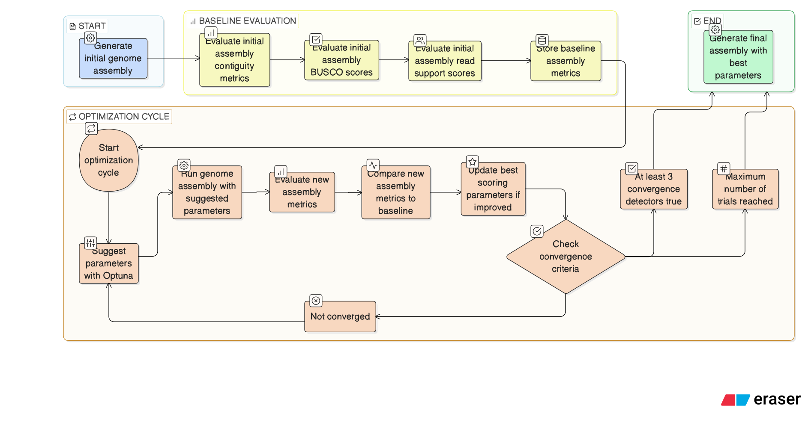

# Hifimizer

**Hifimizer** is a framework for optimizing *de novo genome assembly* parameters using Bayesian optimization.
It wraps **hifiasm** in an automated optimization loop powered by **Optuna**, enabling systematic exploration
of the assembly parameter space instead of manual trial-and-error.

The primary goal is to identify parameter configurations that improve assembly quality for a given dataset,
scored across contiguity, gene-space completeness (compleasm/BUSCO), k-mer completeness and consensus accuracy
(yak), and — for Hi-C runs — **phasing consistency**.

Hifimizer supports standard **PacBio HiFi**, **Hi-C** integrated, **ultra-long ONT** integrated,
and **ONT R10 simplex** assemblies.

> For the full details on scoring, pruning, Hi-C phasing internals, walltime controls, tuning the objective,
> and the output directory layout, see the **[Hifimizer Wiki](../../wiki)**.

---

## Core idea

Genome assemblers use dozens of parameters, many of which interact non-linearly.
Hifimizer treats assembly as an optimization problem:

- parameter space → hifiasm arguments
- objective function → assembly quality relative to the default assembly
- optimizer → Bayesian optimization (Optuna)

Trial 0 runs hifiasm with default parameters. A short **burn-in** of random parameter sets then measures how
far each metric actually moves. Every subsequent trial is scored as a fold change against that baseline,
divided by that metric's measured movement. A multi-criteria convergence detector stops the study early once
the score stops improving.

See **[Scoring: fold change against the default assembly](../../wiki/Home#scoring)** on the
wiki for the full mechanics, including why log2 fold change is used and how the burn-in scale is computed.

> **Note**
>
> Due to the stochastic nature of Bayesian optimization and adaptive sampling,
> the *exact sequence of trials and the final best solution* may vary between runs,
> even when random seeds are set.

### Workflow overview



---

## What gets evaluated

Directions live in `src/optim_directions.json`; importances live in `weights.json`
(see the wiki's [Tuning the objective](../../wiki/Home#tuning-the-objective) section).

| Source | Metric | Meaning |
| --- | --- | --- |
| **gfastats** | `n50` | Contig N50 (contiguity) |
| | `num_contigs` | Number of contigs (fragmentation) |
| | `length_diff` | \|assembly length − expected haploid size\| |
| **compleasm** / **BUSCO** | `single_copy` | Complete single-copy markers |
| | `multi_copy` | Complete duplicated markers |
| | `fragmented` | Fragmented markers (plus compleasm's *incomplete* class) |
| | `missing` | Missing markers |
| **yak** | `qv` | Consensus accuracy (Phred-scaled) from read k-mers |
| | `kmer_completeness` | Fraction of solid read k-mers present in the assembly |
| **Hi-C phasing** | `trans_hap_rate` | Percent of Hi-C links crossing between haplotypes |
| | `hic_pairs_informative` | How many pairs that rate was computed from (unweighted) |

Evaluation is alignment-free apart from Hi-C phasing, and two-haplotype runs are scored per haplotype rather
than averaged — see the wiki for the reasoning and the trade-offs involved (notably, what this design gives up
in terms of misassembly detection).

---

## Installation options

### Option 1: Conda (native execution)

```bash
conda env create -f environment.yml
conda activate optimizer
python3 src/hifimizer.py -h
```

### Option 2: Docker

```bash
docker pull fka21/hifimizer:latest

docker run --rm -v $(pwd):/wd fka21/hifimizer:latest src/hifimizer.py -h
```

> **Note**
>
> If the HPC environment restricts internet connection, download lineage directly *a priori*, and pass
> `--compleasm-download-path` (for compleasm, the default backend) or `--busco-download-path` (for the BUSCO
> fallback). The two are **not** interchangeable. Only the primary backend's dataset is fetched at startup.

---

## Requirements

* Long reads: **PacBio HiFi**, or **ONT R10 simplex** (with `--ont`)
* A haploid genome size estimate
* Optionally: **Hi-C** reads (`--hic1`/`--hic2`) and/or **ultra-long ONT** reads (`--ul`)
* Sufficient computational power for repeated assemblies
* Patience

---

## Quick start

```bash
python3 src/hifimizer.py \
  --genome-size 1.2G \
  --input-reads reads.hifi.fastq.gz \
  --threads 48 \
  --output-dir my_run
```

ONT R10 simplex:

```bash
python3 src/hifimizer.py --genome-size 300M --input-reads reads.ont.fastq.gz --ont
```

Hi-C integrated assembly (also optimizes `--s-base`, `--f-perturb`, `--l-msjoin`, and scores their effect via
`trans_hap_rate`):

```bash
python3 src/hifimizer.py \
  --genome-size 3G --input-reads hifi.fq.gz \
  --hic1 hic_R1.fq.gz --hic2 hic_R2.fq.gz \
  --num-hic-reads 2000000
```

Validate inputs and environment without assembling anything:

```bash
python3 src/hifimizer.py --genome-size 300M --input-reads reads.fq.gz --dry-run
```

The genome size accepts a suffix — `3G`, `1.5Gb`, `300M`, `750k` — or a bare integer interpreted as megabases.

---

## Reruns and resuming

Hifimizer persists its study in `optuna_study.db`, so runs are resumable and specific results can be
reproduced without re-optimizing (`--force-rerun`, `--rerun-best`, `--rerun-trial N`). See the wiki's
[Reruns and resuming](../../wiki/Home#reruns-and-resuming) section for details on what is
required to resume a study.

---

## Output

By default an `output/` directory is created in the current working directory. **Final results live directly
under the output directory; all intermediates live under `work/` and can be deleted to reclaim space** (at the
cost of a full hifiasm recompute on the next run).

The full directory layout, including the contents of `work/`, is documented on the
[wiki](../../wiki/Home#output-directory-layout).

If the best trial turns out to be trial 0, no final assembly is built: the default assembly already on disk
*is* the result, and the log says so rather than spending another hifiasm run reproducing it.

---

## Manual

Run `python3 src/hifimizer.py --help` for the full option descriptions, which are kept in the parser rather
than duplicated here.

## License

Hifimizer is released under the [MIT License](LICENSE).